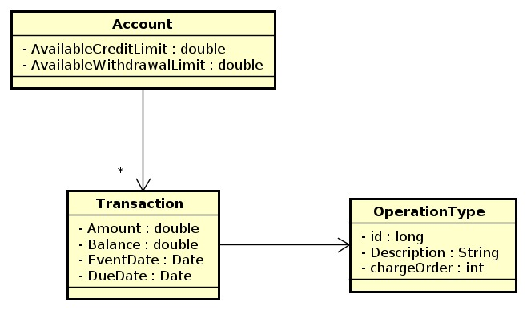

# Desafio Pismo

API desenvolvida em Groovy utilizando o framework Grails para processar transações em uma conta digital.

## Instruções para execução com Docker

* Entrar no diretório da aplicação: ```cd ~/Teste-Pismo/Docker```
* Executar o comando:```docker-compose up -d```
* A aplicação deverá estar rodando em: http://localhost:8081/testepismo/

## Endpoints disponibilizados

POST =>   /login |                 Obter token de acesso utilizado nas chamadas à API

POST =>   /v1/accounts |           Criar uma conta

GET  =>   /v1/limits |             Obter lista de contas

PATCH =>  /v1/accounts/id  |      Atualizar limites de uma conta específica
	
POST =>   /v1/transactions |       Criar uma transação e processar um pagamento caso seja o tipo operação

POST =>   /v1/payments |           Criar e processar uma lista de pagamentos

## Testando a aplicação: Projeto Postman
Segue o link para acesso a documentação do Postman

https://documenter.getpostman.com/view/8486305/SWTG6bHR

## Decisões de projeto

+ #### Framework Grails
Por já estar familiarizado com a tecnologia e com o intuito de agilizar o desenvolvimento, optei por desenvolver o projeto utilizando o framework Grails versão 3.3.0 com Groovy 2.4.11.

+ #### Estrutura do projeto
Este projeto utiliza restful controllers para processar e validar as requisições, services para processar os dados e classes para representar o domínio de dados via hibernate.

+ #### Segurança e Autenticação
Para autenticação foi utilizado Stateless Authentication implementado utilizando o Spring Security.
Inicialmente é necessário realizar uma requisição de login para gerar um token de acesso.

Endoint: ~/Teste-Pismo/login

Payload:
```
{
    "username": "api.pismo",
    "password": "pismoapi"
}
```
Resposta com a geração do token de acesso:

<p align="center">
  
</p>

Este token deverá ser incluído no header das futuras requisições sob a key "X-Auth-Token":

<p align="center">
  
</p>

## Decisões de Negócio

+ #### PATCH => ~/Teste-Pismo/v1/accounts/<id>

Exemplo de payload:

/testePismo/accounts/1

  {
	"available_credit_limit": {
		"amount": 10
	},
	"available_withdrawal_limit": {
		"amount": 2
	}
}
  
Este endpoint receberá valores de limite para ```available_credit_limit``` e ```available_withdrawal_limit``` e abate os respectivos "amount" dos saldos da conta <id>.
  
+ #### GET   => ~/Teste-Pismo/v1/accounts/limits

Este endpoint retorna uma lista de contas "accounts" com as respectivas informações de limite.
  
+ #### POST  => ~/Teste-Pismo/v1/transactions

Exemplo de payload:

```
{
	"account_id": 17, 
	"operation_type_id": 1, 
	"amount": 120.00
}
```

Este endpoint recebe as informações de uma transação em uma conta e cria uma transaction, o valor da transação é automaticamente abatido do limite de crédito se operação de compra ou abatido dos limites de crédito e saque se operação de saque.

Foi criado um setup no projeto para pré cadastrar os tipos de operação suportados, que foram retirados do comando do desafio.
  
+ #### POST  => ~/Teste-Pismo/v1/payments

Exemplo de payload:
```
[
	{
		"account_id": 17, 
		"amount": 30
	},
	{
		"account_id": 17, 
		"amount": 40
	}
]
```

Este endpoint recebe uma lista de pagamentos a serem abatidos das transações da conta informada em cada pagamento. É criado uma transação do tipo operação pagamento. É realizado uma ordenação das transações de acordo com a prioridade (chargeOrder e eventDate) e então cada uma tem o saldo abatido de acordo com o valor disponível do pagamento. Se não houver transações de débito a serem abatidas nenhum pagamento é realizado.

## Esquema de Dados

<p align="center">
  
</p>

## Testes

Os seguintes testes automatizados foram implementados:

# Unit tests

Diretório: Teste-Pismo/src/test/groovy/api/v1
Domain:

	*AccountSpec
	*TransactionSpec
	*OperationType

Controllers:

	* AccountControllerSpec

	* TransactionControllerSpec

	* PaymentControllerSpec

Services

	* AccountServiceSpec

	* TransactionServiceSpec

	* PaymentServiceSpec


# Integration tests

Diretório: /src/integration-test/groovy/testePismo

	* TransactionApiSpec
